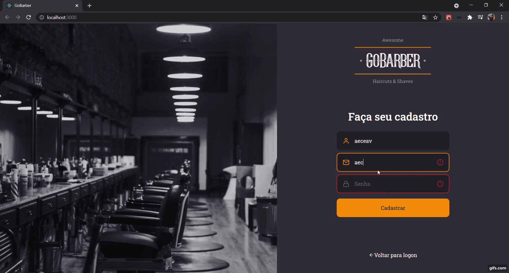
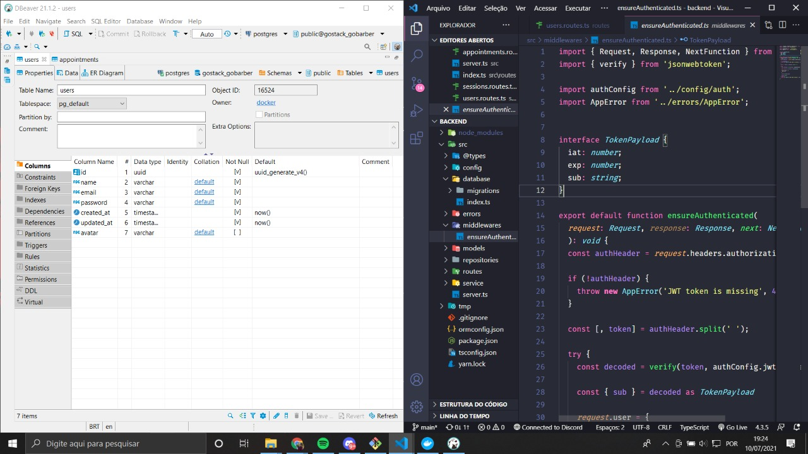

<h1 align="center">
    GoBarber 
</h1>

  <a href="#-tecnologias">Tecnologias</a>&nbsp;&nbsp;&nbsp;|&nbsp;&nbsp;&nbsp;
  <a href="#-projeto">Projeto</a>&nbsp;&nbsp;&nbsp;|&nbsp;&nbsp;&nbsp;

 

SignUp

  

 

  

 

SignIn

  

 

BackEnd

  

## 🚀 Tecnologias

Esse projeto foi desenvolvido com as seguintes tecnologias:

- TypeScript
- CSS
- ReactJS
- Axios
- Docker
- NodeJS

## 💻 Projeto

Este projeto foi feito para melhorar minhas skills em programação.
PS: Em desenvolvimento.